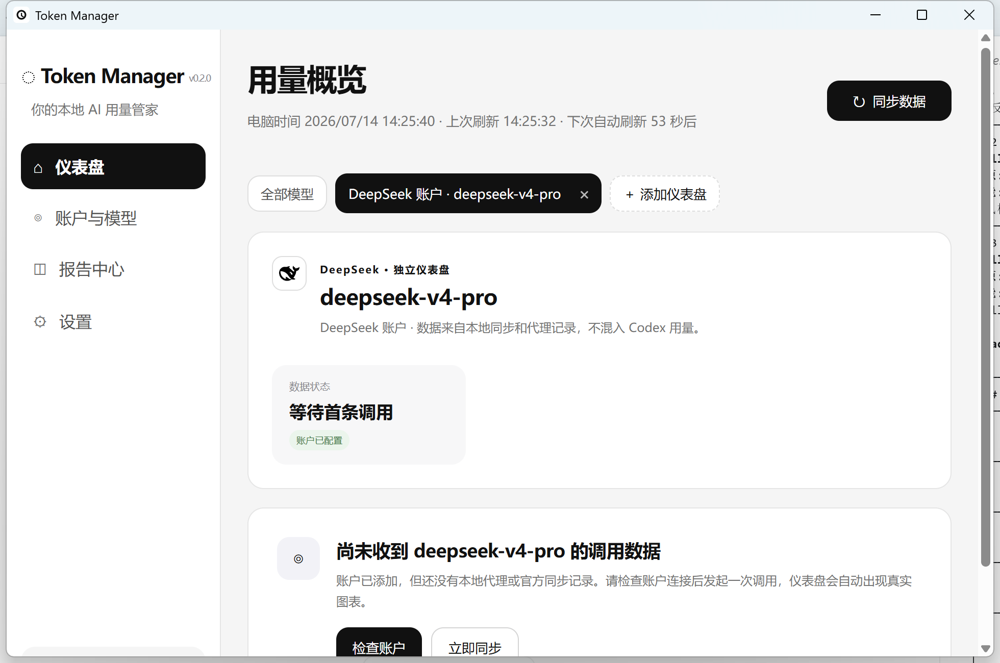

# Token Manager

> Windows 10/11 本地 AI Token、API 请求、余额与消费监控工具。

Token Manager 面向同时使用 Codex、DeepSeek、Claude、Gemini 和国内开放平台的开发者。它把 Codex 本地日志与各类模型 API 的 `usage` 数据统一保存到本机，在一个中文桌面仪表盘中展示 Token、请求次数、缓存命中、成本和余额状态。



## 当前版本

- 版本：`0.2.0`
- 系统：Windows 10/11 x64
- 桌面框架：Tauri 2 + Rust
- 前端：Vue 3 + TypeScript
- 存储：SQLite + Windows DPAPI
- 网络：国产平台按其官方网络环境直连；海外平台能否访问取决于用户网络和账户权限

前往仓库的 **Releases** 页面下载 `TokenManager_0.2.0_x64-setup.exe`。首次发布前，安装包可能尚未经过商业代码签名，Windows SmartScreen 可能显示未知发布者。

## 主要功能

### Codex 本地监控

- 只读访问当前 Windows 用户的 Codex 本地状态库和日志数据库；
- 展示累计 Token、活跃会话、每日 Turn 和 7 天趋势；
- 使用用户自定义预算计算 5 小时、7 天滚动剩余比例；
- 区分全新生成、修改调试和问答解释；
- 20% / 10% 两档 Windows 通知；
- 不读取或保存提示词、回复正文。

> [!IMPORTANT]
> Codex Plus 没有向本工具提供官方会员余额接口。页面中的剩余百分比和重置时间来自本地日志与用户预算模拟，只能作为用量参考，不能当作 OpenAI 官方余额。

### 全平台 API 实时监控

- 一个账户对应一个本机代理地址，仅监听 `127.0.0.1`；
- 记录平台、模型、时间、HTTP 状态、输入/输出/缓存 Token 和成本；
- 不保存 Authorization、请求正文、响应正文或工具调用参数；
- 全部模型提供 7/30 天彩色 Token 柱状图；
- 每个模型可建立独立仪表盘，不混入其他模型或 Codex 数据；
- 支持多账户、模型发现、请求统计、CSV 账单导出和加密迁移。

### 悬浮窗与托盘

- 可拖动、置顶、缩放和折叠；
- 卡片网格与单列模式；
- 可勾选模块并拖动排序；
- 可切换全部模型、Codex 和单模型仪表盘；
- 配置、窗口尺寸和模块顺序均保存在本机。

## 支持的平台

| 平台 | 代理 Token 统计 | 模型发现 | 官方余额/账单 |
| --- | :---: | :---: | --- |
| Codex | 本地日志 | 自动识别 | 本地预算估算，不冒充官方余额 |
| DeepSeek | 已验证 | 支持 | 已验证 `/user/balance` 人民币余额 |
| OpenAI / OpenAI 兼容 | 已验证 | 视上游而定 | 普通模型 Key 不等同组织账单权限 |
| Anthropic Claude | 已验证 | 内置目录 | 需独立组织账单权限 |
| Google Gemini | 已验证 | 内置目录 | Cloud Billing 需独立 IAM |
| 腾讯混元、豆包、文心千帆、通义百炼、智谱、Kimi、MiMo、讯飞星火、MiniMax、阶跃星辰、零一万物、商汤日日新、百川 | OpenAI 兼容响应可统计 | 官方接口或内置目录 | 依平台 AK/SK、签名、账单权限或账单导入能力 |

平台可添加并不代表普通模型 API Key 一定能查询账户账单。详情见 [数据来源说明](docs/DATA_SOURCES.md)。

## 三分钟开始使用

1. 安装并启动 Token Manager。
2. 打开“账户与模型”，选择平台并点击“添加账户”。
3. 填写账户名称、官方 Base URL 和 API Key；Key 会由 Windows DPAPI 加密。
4. 点击页面右上角“一键开启 API 实时监控”。
5. 将调用工具的 Base URL 改成应用显示的 `http://127.0.0.1:<端口>/v1`。
6. 发起一次真实请求，再回到仪表盘同步数据。

完整步骤见 [用户使用手册](docs/USER_GUIDE.md) 和 [安装说明](docs/INSTALLATION.md)。

## 数据与隐私

- 默认零遥测、零云端账户、零密钥上传；
- API Key 由 Windows DPAPI 绑定当前用户加密；
- SQLite 数据默认位于 `%LOCALAPPDATA%\\Token Manager\\token-manager.db`；
- 本地代理拒绝局域网访问；
- 备份文件使用用户设置的迁移密码加密；
- 官方余额查询仅访问对应厂商官方 API。

详见 [安全与日志说明](docs/logs-and-security.md) 与 [安全策略](SECURITY.md)。

## 本地开发

### 环境要求

- Node.js 20 LTS
- Rust stable，目标工具链 `x86_64-pc-windows-msvc`
- Visual Studio 2022“使用 C++ 的桌面开发”工作负载
- Windows WebView2 Runtime

### 开发命令

```powershell
npm install
npm run dev
```

启动完整桌面端：

```powershell
npm exec tauri dev
```

运行检查：

```powershell
npm run build
cargo test --manifest-path src-tauri/Cargo.toml
```

生成 NSIS 安装包：

```powershell
npm exec tauri build
```

输出目录：`src-tauri/target/release/bundle/nsis/`。

## 项目结构

```text
src/                         Vue 界面、仪表盘与悬浮窗
src/components/              通用组件和官方平台标志
src/features/                Codex 留存分析与本地换算
src-tauri/src/               Rust 数据库、DPAPI、代理、通知与托盘
docs/                        安装、使用、数据来源与扩展文档
screenshots/                 产品截图
.github/workflows/           Windows CI 与 Release 构建
```

## 文档

- [安装与卸载](docs/INSTALLATION.md)
- [普通用户使用手册](docs/USER_GUIDE.md)
- [数据来源和准确性](docs/DATA_SOURCES.md)
- [日志与密钥安全](docs/logs-and-security.md)
- [新增平台适配器规范](docs/adapter-development.md)
- [Codex 留存功能说明](docs/codex-retention-features.md)
- [官方 Logo 来源](docs/provider-logo-sources.md)
- [更新记录](CHANGELOG.md)
- [参与贡献](CONTRIBUTING.md)

## 已知限制

- Codex 会员剩余额度无法通过官方接口读取，目前为本地观测估算；
- 仅 DeepSeek 普通 API Key 的人民币余额接口已在当前版本中完成验证；
- 其他云平台的官方账单通常需要 AK/SK、签名、地域及账单权限，当前不会伪造实时余额；
- 账单导出当前为 UTF-8 CSV，可直接使用 Excel 打开；
- 正式大规模分发前仍应配置 Windows 代码签名证书。

## 商标与关联声明

Token Manager 是独立的第三方本地工具，与 OpenAI、Anthropic、Google、DeepSeek、腾讯、字节跳动、百度、阿里云、智谱、小米、月之暗面、讯飞、MiniMax、阶跃星辰、零一万物、商汤或百川不存在隶属、合作或官方背书关系。平台名称和标志仅用于准确识别用户自行配置的服务，权利归各自所有者。

## 许可证

本仓库暂未附加开源许可证。在仓库所有者明确选择许可证前，默认保留全部权利；公开源码不等于自动授权复制、修改或再分发。
