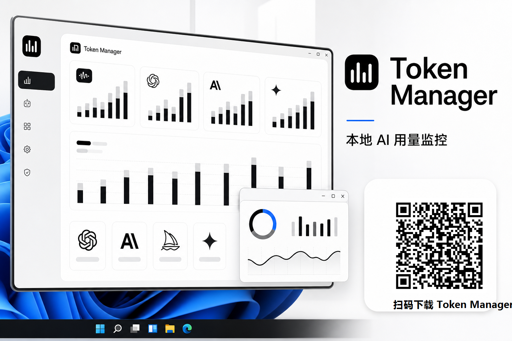

# Token Manager 宣传素材

## 一句话介绍

Token Manager，让开发者在 Windows 上看清每一次 AI 调用：Token、请求次数、缓存命中、余额、成本和预算预警，全部集中在一个本地优先的仪表盘里。

## 宣传文案

### 主标题

**Token Manager：你的本地 AI 用量管家**

### 短文案

不再猜额度，也不必在多个控制台之间来回切换。Token Manager 将 Codex、DeepSeek、OpenAI 兼容 API 及主流模型的 Token 用量、请求次数、缓存命中、余额和人民币成本统一呈现；支持本地日志解析、API 代理计量、预算预警与可拖动悬浮窗，让每一次生成都更透明、更可控。

### 卖点文案

- Codex 独立监控：5 小时/7 天滚动窗口与本地观测估算。
- 全模型仪表盘：Token、请求次数、缓存命中、消费金额分项统计。
- 本地优先：密钥加密保存，日志和统计数据不上传云端。
- 随时可见：可拖动、置顶、可折叠悬浮窗，余额与预警一眼掌握。
- 开发者友好：支持多账户、兼容 OpenAI 协议、CSV 账单导出。

## 下载

[下载 Token Manager 0.2.0（Windows x64 安装版）](https://github.com/fatimabentz691-max/HUSSEL/releases/download/v0.2.0/TokenManager_0.2.0_x64-setup.exe)

[查看全部 Release](https://github.com/fatimabentz691-max/HUSSEL/releases)

## 宣传图

图中二维码指向 Windows x64 安装版直链。
